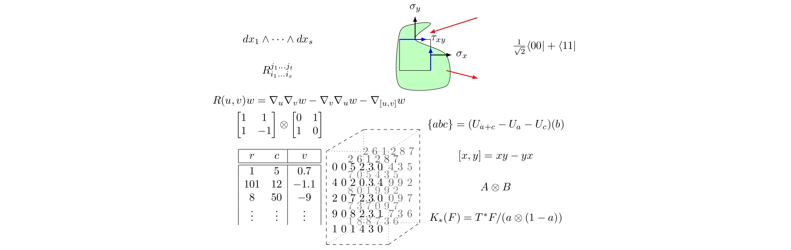

Tensors have different meanings to different people.



So why not abstract the differences into _Tensor Spaces_. Now all it means to be a tensor is...
> A tensor is an element of a tensor space.

## Contents

- [Contents](#contents)
- [Acknowledgements](#acknowledgements)
- [Our Team](#our-team)
- [Copying](#copying)
- [Repository Structure](#repository-structure)
- [Install](#install)
    - [Downloading Latest Release](#downloading-latest-release)
    - [Linux and Mac users](#linux-and-mac-users)
    - [Manually](#manually)
- [Update](#update)
    - [Linux and Mac users](#linux-and-mac-users-1)
    - [Manually](#manually-1)
- [Uninstall](#uninstall)
- [Feedback and Bugs](#feedback-and-bugs)

The Experimental Multilinear Algebra Group's distribution of software for 
integration in the computer algebra system MAGMA, V2.22 and beyond.

This software was created by Joshua Maglione and James B. Wilson, Copyright 2016--2020. Distributed under MIT License.

If you want a copy of the software under a different license, please contact the authors. 


## Acknowledgements

TensorSpace was developed by researchers at Colorado State University and 
partially supported by a National Science Foundation grant DMS-1620454 to Wilson.  We also acknowledge U. Auckland, U. Bielefeld, Bucknell U., Hausdorff Research Institute for Mathematics, and Kent State U. where research was undertook and support provided for this package.


## Our Team

We invite you explore the repository and join our team.  We welcome and encourage any contributions to the repository. If you need help getting started, please feel free to @-mention any of the contributors below or you can read the repository's [Projects](https://github.com/thetensor-space/TensorSpace/projects) tab.

|                                                                              | Name                | Username                         | 
-------------------------------------------------------------------------------|---------------------|----------------------------------|
      | Peter A. Brooksbank | [`@galois60`](https://github.com/galois60)                |
  | Joshua Maglione     | [`@joshmaglione`](https://github.com/joshmaglione)        |
       | James B. Wilson     | [`@algeboy`](https://github.com/algeboy)                  |


## Copying

This program is free software: you can redistribute it and/or modify it 
under the terms of the MIT license.

This program is distributed in the hope that it will be useful, but without any
warranty; without even the implied warranty of merchantability or fitness for a particular purpose. 


## Repository Structure
```
TensorSpace/
  doc/                           Documentation folder of all LaTeX files
    TensorSpace.pdf              The documentation for TensorSpace
  examples/                      Folder of examples demonstrated in documentation
  src/                           Source code folder 
    Homotopism/                  Hmtp code data structure
    Tensor/                      TenSpcElt code and data structure
    TensorCategory/              TenCat code and data structure
    TensorSpace/                 TenSpc code and stat structure
    Util/                        Utility functions
  tests/                         Folder of performance and debugging tests
  install.sh                     Shell file to install repo
  TensorSpace.spec               Magma spec file
  update.sh                      Shell file to update repo
```


## Install

#### Downloading Latest Release

The latest release of TensorSpace can be downloaded as either a `tar.gz` or `zip` file here:

[Latest Release](https://github.com/thetensor-space/TensorSpace/releases/latest) 


#### Linux and Mac users

We will assume your directory for Magma packages is titled `my_magma_packages` but replace this name if it is different. You can create this directory with:
```
$ mkdir my_magma_packages
```
Download `TensorSpace-x.y.tar.gz` from the latest release into `my_magma_package`. Then you could run the following to unzip TensorSpace and install the package.
```
$ cd my_magma_packages
$ gzip TensorSpace-x.y.zip
$ sh TensorSpace/install.sh
```

This may install further packages necessary in `my_magma_packages`. It may also modify your Magma start file (`~/.magmarc`) so that these packages are available at the start of a Magma session. To avoid this, use the manual installation instructions below.


#### Manually

Currently, we do not have an install file compatible with Windows. 

Attach the spec file during a Magma run and the intrinsics will be available
to use.  To attach the spec file, run the following, where `<location>` is the directory containing TensorSpace,
```
> AttachSpec("<location>/TensorSpace/TensorSpace.spec");
```


## Update

#### Linux and Mac users

To update the package and all its dependencies, run the following shell command.
```
$ sh TensorSpace/update.sh
```

#### Manually

We currently do not have an update file compatible for Windows. 

To manually update, either download the latest release, see [here](#Downloading-Latest-Release), or pull from GitHub with the following.
```
$ cd TensorSpace/
$ git pull origin master
```


## Uninstall

This package can be removed entirely by deleting the folder into which it was downloaded and removing the following lines from your `~/.magmarc` file.
```
AttachSpec("<location>/TensorSpace/TensorSpace.spec");
```


## Feedback and Bugs

We welcome general feedback about the package and challenging examples. To report bugs, please create a [New Issue](https://github.com/thetensor-space/TensorSpace/issues/new) under the [Issues](https://github.com/thetensor-space/TensorSpace/issues) tab in the TameGenus repository, or @-mention any of the above contributors in your forked repository.

